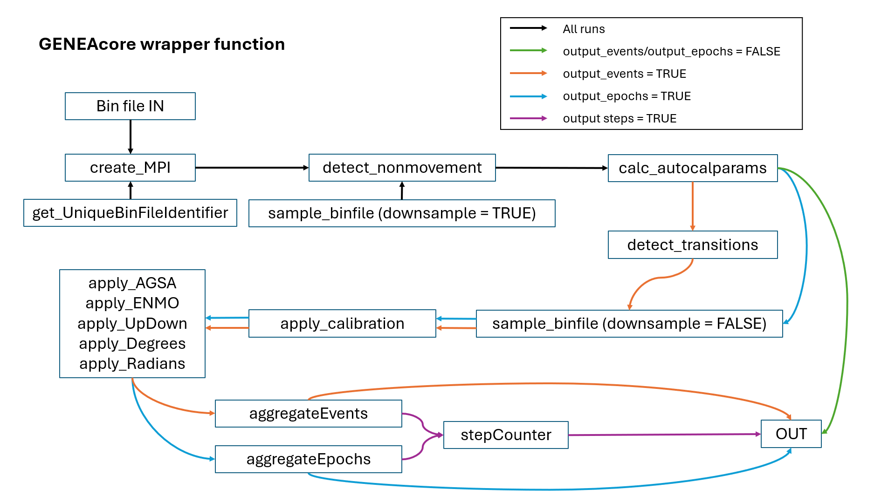

```{r, include = FALSE}
knitr::opts_chunk$set(
  collapse = TRUE,
  comment = "#>"
)
```

## Overview

The R package GENEAcore provides functions and analytics to read in and summarise raw GENEActiv accelerometer data into time periods of fixed or variable lengths for which a wide range of features are calculated.

## Introduction and Installation

### i. Introduction

This vignette provides a general introduction on how to use GENEAcore.

### ii. Install R and RStudio

To begin, download and install [R](https://cran.r-project.org/). An introduction to the R environment can be found in the [R manual](https://cran.r-project.org/doc/manuals/r-release/R-intro.pdf), which will help familiarize users with its basics. We also recommend downloading and installing the IDE (integrated development environment) [RStudio](https://posit.co/products/open-source/rstudio/) after R has been installed. RStudio provides the user with more than the console to work with and gives the option of having a script, console, view of the R environment and file locations in one window. The list of tips on using RStudio can be found [here](https://posit.co/resources/cheatsheets/).

### iii. Install and Load Package

If installing GENEAcore with its dependencies from CRAN, use a single command:

```{r Installing from CRAN, eval = FALSE}
install.packages("GENEAcore", dependencies = TRUE)
```

Whilst GENEAcore is in development, the easiest way to install the package is to use the tar.gz folder in which this vignette sits inside. GENEAcore has a package dependency that will also need to be installed. Both GENEAcore and its dependency can be installed by running this code in the console:

```{r Installing from source, eval = FALSE}
# Note that R only uses / not \ when referring to a file/directory location
install.packages("changepoint")
install.packages("signal")
install.packages("C:/path/to/GENEAcore_1.0.0.tar.gz", repos = NULL, type = "source")
```

Once the packages have been installed, load in the libraries:

```{r Loading in the GENEAcore library, eval = FALSE}
library(GENEAcore)
library(changepoint)
```

## Using GENEAcore

### i. Folder preparation

GENEAcore has been written to process only .bin files extracted from GENEActiv (ActivInsights Ltd) devices. Place all .bin files for analysis in a single folder on your computer. You can organise your analysis folder structure by project, with all files for a specific project stored together.

### ii. GENEAcore wrapper function

The GENEAcore package offers a number of functions and parameters within its processing workflow. To ease user interaction, interactions between functions are managed by a single main function, `geneacore`.

Sequentially, `geneacore` performs the following:

-   Reads in the data
-   Creates a Measurement Period Information (MPI) file
-   Downsamples data to 1Hz and detects non-movement points
-   Calculates auto-calibration parameters
-   Detects suspected non-wear
-   Detects event transition points using mean and variance changepoints
-   Applies calibration parameters to raw data
-   Applies measure calculations on calibrated data
-   Aggregates and outputs calibrated data into specified fixed epochs or events

At a minimum, `geneacore` can be run with just a single parameter; `data_folder` is the folder where the .bin files to be analysed are stored. Outputs are automatically directed to the same data folder. All other parameters are optional with defaults assigned.

```{r Running geneacore, eval = FALSE}
library(GENEAcore)
geneacore(data_folder = "C:/path/to/datafolder")
```

In outline, the optional parameters and their defaults are:

-   `CutTime24Hr` is the 24 hour time to split days up by. Defaults to **15:00** (3.00pm).
-   `output_epochs` specifies whether epochs should be created as an output. Defaults to **TRUE**. Else, FALSE.
-   `epoch_duration` specifies duration to aggregate epochs by. This will be the duration of each epoch in the outputs. Defaults to **1** second.
-   `output_events` specifies whether events should be created as an output. Defaults to **TRUE**. Else, FALSE.
-   `output_steps` specifies whether step counts and stepping rate should be included in the aggregated epochs or events outputs. Defaults to **FALSE**. Else, TRUE.
-   `output_csv` allows CSV outputs to be saved during epoch and event processing. Defaults to **FALSE** and only RDS files are saved. Else, TRUE.
-   `timer` prints the elapsed processing times for development purposes. Defaults to **FALSE**. Else, TRUE.

A sample run with all parameters included will be:

```{r Running geneacore with parameters, eval = FALSE}
library(GENEAcore)
geneacore(
  data_folder = "C:/path/to/datafolder",
  CutTime24Hr = "15:00",
  output_epochs = TRUE,
  epoch_duration = 600, # 10 minutes
  output_events = FALSE,
  output_steps = FALSE,
  output_csv = TRUE,
  timer = FALSE
)
```

### iii. Expected outputs

GENEAcore produces the following outputs for each .bin file processed:

-   RDS files of the MPI, downsampled data, epochs and events (where selected)
-   CSV files of epochs and events (where selected)

**MPI**

The MPI (measurement period information) contains header information of the .bin file and meta data essential for downstream file processing and interpretation. The MPI also stores calibration, non-wear and transitions information.

**Downsampled data**

A step prior to detecting non-wear and transition events, the data is first downsampled to 1Hz to improve speed and memory management.

**Epochs**

Epochs are a fixed duration aggregation of raw sensor data in SI units. The aggregates include a wide range of statistical processing with epoch duration specified in `epoch_duration`.

**Events**

Event are a variable duration aggregation of raw sensor data in SI units. The aggregates include a wide range of statistical processing with event durations determined by transitions identified in the MPI. The time of day defined in `CutTime24Hr` adds an additional transition point to mark the start and end of a day.

The epochs or events can then be used for further analysis within R, e.g., classification of behaviours. It can also be exported as CSV `output_csv = TRUE` for post-processing outside of R.

### iv. Bin file summary

GENEAcore provides users with the options of running a bin file summary to check the contents and integrity of the bin file.

It is advisable to perform an overview summary of the bin files in your folder to ensure they are suitable for processing. Review the errors generated in the summary and remove any files that are not appropriate to run before proceeding with a full `geneacore` run. Additionally, use this process to identify and eliminate any duplicate files (e.g., identical files with different binfile names).

To generate a summary for a single file, specify only the file path as the input parameter. 

```{r Bin file summary, eval = FALSE}
# Run summary for a single bin file
binfile_summary <- binfile_summary("C:/path/to/binfile.bin")
```

To create a summary for a folder of files, provide the folder path as the input parameter. This will generate a single summary for all bin files in the folder, including those in subfolders. If you want to exclude bin files in subfolders, use the optional parameter `recursive = FALSE`. By default, `recursive` is set to `TRUE`. 

The summary is assigned to the variable name you have provided. You can then save the data frame to a CSV or RDS as required.

```{r Bin file folder summary, eval = FALSE}
# Run summary for all bin files in bin files folder only
binfile_folder_summary <- binfile_summary("C:/path/to/binfilesfolder", recursive = FALSE)
```

### v. MPI summary

After a complete MPI run, you might want to look at a comprehensive summary of your files that include the non-movement and transitions information. To do this, the summary must be generated from MPI RDS files instead of bin files. 

To generate a summary for a single MPI file, specify the file path as the input parameter.  

```{r MPI summary, eval = FALSE}
# Run summary for single MPI file
mpi_summary <- MPI_summary("C:/path/to/MPI.rds")
```

To generate a summary for a folder of MPI RDS files, specify the folder path as the input parameter. By default, the summary function looks at all files within the folder, including subfolders. To ignore files in subfolders, specify the parameter `recursive = FALSE`. Do note that `geneacore()` saves all MPI RDS files in their corresponding bin file subfolders. 

The summary is assigned to the variable name you have provided. You can then save the data frame to a CSV or RDS as required. 

```{r MPI folder summary, eval = FALSE}
# Run summary for all MPI files in a folder
mpi_folder_summary <- MPI_summary("C:/path/to/MPIfolder")
```

## Individual access to functions

For greater control over your generated outputs, you can execute each function individually with your preferred parameter values. Each function operates on a single bin file at a time. To apply any function to a folder of bin files, you will need to iterate through all the files in the folder and apply each function individually. An example demonstrating this is shown in the Appendix.

Before executing any function, whether individually or sequentially, you must first configure your bin file and output folder. If running functions sequentially, this setup only needs to be done once per file.

```{r File preparation before individual runs, eval = FALSE}
binfile_path <- "C:/path/to/binfile"
output_folder <- "C:/path/to/outputfolder"

con <- file(binfile_path, "r")
binfile <- readLines(con, skipNul = TRUE)
close(con)
```

Creating the Measurement Period Information (MPI) manually for each file is an optional step. The MPI contains metadata used later for sampling, detecting non-movement and transitions, and calculating auto calibration parameters. If you run any of these functions directly, the MPI will be created automatically if it doesn't already exist, so you don't need to create it separately. However, if you prefer to create the MPI manually, here's how you can do it:

```{r Create MPI, eval = FALSE}
MPI <- create_MPI(binfile, binfile_path, output_folder)
```

The MPI is saved in your specified output folder as an RDS file. Make sure to use the same output folder consistently when running the rest of the functions throughout the processing.

### i. Sampling your files

The `sample_binfile` function provides two functionalities: downsampling and raw sampling. Both functionalities allow you to sample a portion of the file between two specified timestamps, which are passed to the `start_time` and `end_time` parameters. If no start and end time are specified, the file is sampled from the beginning to the end of the file.
The sampling output is a matrix with columns for timestamp, x, y, z, light, temperature, and voltage. In downsampling, measurements are taken at each whole second. In raw sampling, every measurement is included in the output (e.g., at 10Hz, there would be 10 measurements per second).

**Downsampling** 

Downsampling enhances the efficiency of calculating non-movement, changes in movement, and calibration values, allowing you to quickly review your data without processing all data points. We downsample to 1Hz.

For a basic downsample run, you only need to specify the bin file, bin file path, and output folder. This will downsample your entire file. 

```{r Downsampling a file default, eval = FALSE}
# Simple run using default parameter values
downsampled_measurements <- sample_binfile(binfile, binfile_path, output_folder)
```

If you wish to downsample only a portion of the file, adjust the `start_time` and `end_time` parameters, ensuring both times are in Unix timestamp format. You can also choose to save the downsampled measurements as a CSV by setting `output_csv = TRUE`. By default, only an RDS object is created.

```{r Downsampling a file with parameters, eval = FALSE}
# Exposed parameters can be changed
downsampled_measurements <- sample_binfile(binfile, binfile_path, output_folder,
  start_time = NULL,
  end_time = NULL,
  output_csv = FALSE
)
```

**Raw sampling**

Raw sampling allows you to process all data points in your file by running the `sample_binfile()` function with the parameter `downsample = FALSE`. Raw sampling can be done on the entire file using the basic run or on a specific portion of the file by specifying the start and end times. The raw sample data is saved as an RDS file, with the start and end timestamps of the sampling period included in the filename.

```{r Raw sampling a file default, eval = FALSE}
# Simple run using default parameter values
raw_measurements <- sample_binfile(binfile, binfile_path, output_folder, downsample = FALSE)
```

```{r Raw sampling a file with parameters, eval = FALSE}
# Exposed parameters can be changed
raw_measurements <- sample_binfile(binfile, binfile_path, output_folder,
  start_time = NULL,
  end_time = NULL,
  downsample = FALSE,
  output_csv = FALSE
)
```

### ii. Creating calibration values from your data

Calibration is performed on sampled raw data before calculating measures or conducting any further analysis to correct for errors and improve the accuracy of measurements. There are two types of calibration available: factory calibration and auto calibration, with an additional option for temperature compensation.

**Factory calibration**

GENEActiv accelerometers are calibrated during the manufacturing process. The calibration values obtained during this process is stored in the bin file. During MPI creation, these values are read and saved in the MPI as factory calibration values. 

**Auto calibration**

During real-world use, factors such as temperature variations, mechanical stress, and sensor drift can introduce errors over time. Auto calibration uses data collected during the accelerometer's operation to provide a more accurate calibration than the initial manufacturer calibration, reducing these errors. Doing so lowers the noise floor and enhances measurement sensitivity. The process involves identifying non-movement periods in the data and fitting these points onto a unitary sphere. Calibration values are then calculated based on deviations from the sphere. If available, temperature data can be incorporated here to further refine the calibration values.

```{r Auto calibration default, eval = FALSE}
## Two steps in obtaining auto calibration parameters:

# 1. Identify non-movement periods
MPI <- detect_nonmovement(binfile, binfile_path, output_folder)
# 2. Calculate auto-calibration parameters, temperature compensation TRUE by default
MPI <- calc_autocalparams(binfile, binfile_path, output_folder, MPI$non_movement$sphere_points)
```

The parameters for non-movement detection and auto calibration calculation can be adjusted as needed. The parameters and their default values are listed below. For detailed descriptions of each parameter, please refer to the documentation of the respective function.

```{r Calibrating your data parameters, eval = FALSE}
# Detect non-movement
MPI <- detect_nonmovement(binfile, binfile_path, output_folder,
  still_seconds = 120,
  sd_threshold = 0.011,
  temp_seconds = 240,
  border_seconds = 300,
  long_still_seconds = 120 * 60,
  delta_temp_threshold = -0.7,
  posture_changes_max = 2,
  non_move_duration_max = 12 * 60 * 60
)

# Calculate auto-calibration parameters
MPI <- calc_autocalparams(binfile, binfile_path, output_folder,
  MPI$non_movement$sphere_points,
  use_temp = TRUE,
  spherecrit = 0.3,
  maxiter = 500,
  tol = 1e-13
)
```


### iii. Applying calibration values to your data

To calibrate your data for analysis, use the `apply_calibration()` function to apply either the factory calibration values or the auto calibration values to your raw sampled data. The light calibration process varies between GENEActiv 1.1 and GENEActiv 1.2, so measurement device must be correctly specified.

```{r Apply calibration, eval = FALSE}
# Sample data
raw_measurements <- sample_binfile(binfile, binfile_path, output_folder, downsample = FALSE)

# Apply factory calibration
calibrated_factory <- apply_calibration(raw_measurements, MPI$factory_calibration, MPI$file_data[["MeasurementDevice"]])

# Apply auto calibration
calibrated_auto <- apply_calibration(raw_measurements, MPI$auto_calibration, MPI$file_data[["MeasurementDevice"]])
```

### iv. Detecting transitions in your data for event aggregation

The `detect_transitions` function detects mean and variance changepoints in downsampled 1Hz acceleration data from a bin file, using the changepoint package dependency. The default run is shown below.

```{r Detect transitions for event aggregation default, eval = FALSE}
MPI <- detect_transitions(binfile, binfile_path, output_folder)
```

Alternatively, you can modify the minimum event duration, x, y or z changepoint penalties, or the 24-hour cut time.

```{r Detect transitions for event aggregation parameters, eval = FALSE}
MPI <- detect_transitions(binfile, binfile_path, output_folder,
  minimum_event_duration = 3,
  x_cpt_penalty = 20,
  y_cpt_penalty = 30,
  z_cpt_penalty = 20,
  CutTime24Hr = "15:00"
)
```

### iv. Applying calculations to raw data to obtain additional measures

After calibrating the data, you can apply a series of calculation functions to compute measures for your final aggregated output. The functions include:

- `apply_updown`: Elevation
- `apply_degrees`: Rotation
- `apply_radians`: Rotation
- `apply_AGSA`: Absolute Gravity-Subtracted Acceleration
- `apply_ENMO`: Euclidean Norm Minus One

Simply apply the desired function to your dataset. To apply multiple functions to the same dataset, you can use nested function calls. The sequence in which the functions are nested determines their order in the outputs. The calculation is applied from the innermost to the outermost nest.

```{r Applying calculations on calibrated data, eval = FALSE}
# To apply one measure calculations
calibrated_measure <- apply_AGSA(calibrated)

# To apply multiple on the same data set
calibrated_measures <- apply_degrees(
  apply_updown(
    apply_AGSA(
      apply_ENMO(calibrated)
    )
  )
)
```

### v. Aggregating your raw data into epochs/events

To aggregate epochs or events, a series of steps must first be completed. Each step is detailed in its own section in this vignette.

1. Detect Transitions (required for event aggregation only)
2. Calculate Auto calibration Parameters
3. Sample Raw Data
4. Apply Calibration Values
5. Apply Additional Measures

**Event Aggregation:** Pass the transitions as a parameter to the `aggregateEvents()` function. Note that event aggregation must be performed day by day due to the structure of transitions. Ensure you use the same CutTime24Hr when detecting transitions and when splitting the days during sampling. An example of day by day event aggregation is provided in the Appendix.

```{r Aggregating events, eval = FALSE}
events_agg <- aggregateEvents(calibrated,
  measure = c("x", "y", "z", "AGSA"),
  time = "timestamp",
  sample_frequency = sample_frequency,
  events = events,
  fun = function(x) c(mean = mean(x), sd = sd(x))
)
```

**Epoch Aggregation:** Pass the desired epoch duration as a parameter to the `aggregateEpochs()` function. While epoch aggregation can be performed on the entire dataset, it may be computationally intensive for large datasets. We recommend splitting your data into manageable day chunks.

```{r Aggregating epochs, eval = FALSE}
epochs_agg <- aggregateEpochs(calibrated,
  duration = 1,
  measure = c("x", "y", "z", "AGSA", "ENMO"),
  time = "timestamp",
  sample_frequency = MPI$file_data[["MeasurementFrequency"]],
  fun = function(x) c(mean = mean(x), sd = sd(x))
)
```

## Appendix

### i. GENEAcore functions flowchart

```{r GENEAcore flowchart, echo=FALSE}

```

### ii. Sample code to loop functions for a folder of files

This example iterates through a folder and does the following for each bin file in the folder:

- Creates a project folder
- Reads in bin file
- Creates an MPI object
- Downsamples data
- Detects nonmovement
- Calculates auto calibration parameters

```{r Loop functions for folder, eval=FALSE}
data_folder <- "C:/path/to/folder"
data_files <- (list.files(data_folder, pattern = "(?i)\\.bin$"))

for (seq in 1:length(data_files)) {
  binfile_path <- file.path(data_folder, data_files[seq])
  project <- gsub("\\.bin", "", basename(binfile_path))
  output_folder <- file.path(data_folder, project)
  if (!file.exists(output_folder)) {
    dir.create(output_folder)
  }
  # Open file connection and read file
  con <- file(binfile_path, "r")
  binfile <- readLines(con, skipNul = TRUE)
  close(con)
  # Create MPI
  MPI <- create_MPI(binfile, binfile_path, output_folder)
  # Downsample file and detect non-movement
  MPI <- detect_nonmovement(binfile, binfile_path, output_folder)
  # Calculate auto-calibration parameters
  MPI <- calc_autocalparams(
    binfile, binfile_path, output_folder,
    MPI$non_movement$sphere_points
  )
}
```

### iii. Sample code to aggregate events by day

The following excerpt from the` geneacore()` function demonstrates how to determine the date range of your file, then sample, calibrate, and aggregate the data by day. Finally, it combines everything into a single aggregated output. The example provided is for events, but the same logic applies to epochs using the appropriate functions. If running for events, ensure that transitions are executed as part of MPI beforehand. See [Detecting transitions in your data for event aggregation](#iv.-detecting-transitions-in-your-data-for-event-aggregation) for more information on how to run `detect_transitions()`.

```{r Aggregating events day by day, eval = FALSE}
# Prepare time borders of each day
cut_time <- strptime(CutTime24Hr, format = "%H:%M")$hour
cut_time_shift <- (cut_time * 60 * 60) - MPI$file_data[["TimeOffset"]]
first_day <- as.Date(as.POSIXct(MPI$file_info$firsttimestamp - cut_time_shift, origin = "1970-01-01"))
last_day <- as.Date(as.POSIXct(MPI$file_info$lasttimestamp - cut_time_shift, origin = "1970-01-01"))

# Generate start and end time for each day we need to process
days_to_process <- seq(first_day, last_day, by = 1)
date_range <- lapply(days_to_process, FUN = function(x) {
  c(
    "start" = max(MPI$file_info$firsttimestamp, as.numeric(as.POSIXlt(x)) + cut_time_shift),
    "end" = min(MPI$file_info$lasttimestamp, as.numeric(as.POSIXlt(x + 1)) + cut_time_shift)
  )
})
date_range <- data.frame(t(sapply(date_range, c)))

sample_frequency <- MPI$file_data[["MeasurementFrequency"]]
events_list <- list()

# Sample, calibrate and aggregate the data day-by-day
for (day_number in 1:nrow(date_range)) {
  results <- sample_binfile(binfile, binfile_path, output_folder,
    start_time = date_range[day_number, 1],
    end_time = date_range[day_number, 2],
    downsample = FALSE
  )

  calibrated <- apply_calibration(results, MPI$auto_calibration, MPI$file_data[["MeasurementDevice"]])

  calibrated <- apply_AGSA(calibrated)

  day_transitions <- transitions[transitions$day == day_number, "index"]
  events <- data.frame(
    "start" = day_transitions[-length(day_transitions)],
    "end" = floor(sample_frequency * (day_transitions[-1]))
  )
  if (nrow(events) > 1) {
    events$start[2:nrow(events)] <- events$end[-nrow(events)] + 1
  }
  events_agg <- aggregateEvents(calibrated,
    measure = c("x", "y", "z", "AGSA"),
    time = "timestamp",
    sample_frequency = sample_frequency,
    events = events,
    fun = function(x) c(mean = mean(x), sd = sd(x))
  )
  events_list[[day_number]] <- events_agg
}

# Combine daily aggregated events into a single output
events_df <- do.call(rbind, events_list)
```
